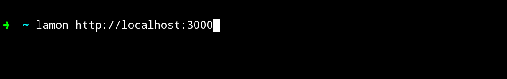
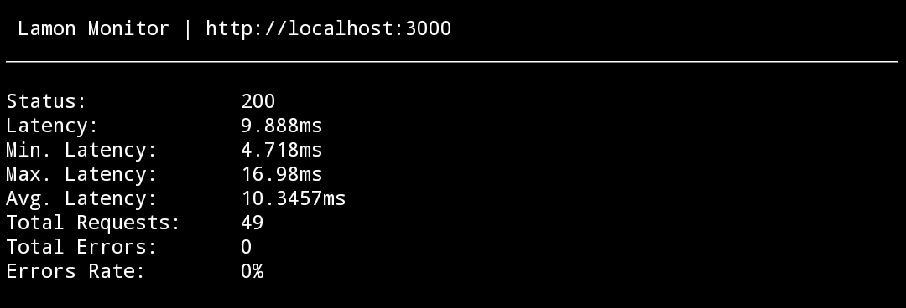

#  Lamon
Lamon is a monitor for viewing API performance directly from the terminal.

Lightweight. Fast. No browser required.

---

## Features

Monitor API latency and status in real time

Works directly in the terminal

Lightweight and fast

No UI, no browser, no bloat

Simple CLI usage

---

## Install

## 1.Install with executables
### Linux / macOS
./install.sh

### Windows
powershell -ExecutionPolicy Bypass -File install.ps1

## 2.Install with CMake
cmake -B build && cmake --build build && sudo cmake --install build

---

## Usage

Example output:

---

## Why Lamon?

When debugging APIs, opening a browser or heavy tools slows you down. Lamon keeps everything inside the terminal so you can monitor performance instantly while coding.

---

## Roadmap

Multiple endpoint monitoring

Graph mode

JSON output

Config file support

Alerts

---

## Contributing

Pull requests are welcome.

1. Fork the repo

2. Create a branch

3. Commit changes

4. Open a PR

For major changes, open an issue first.
